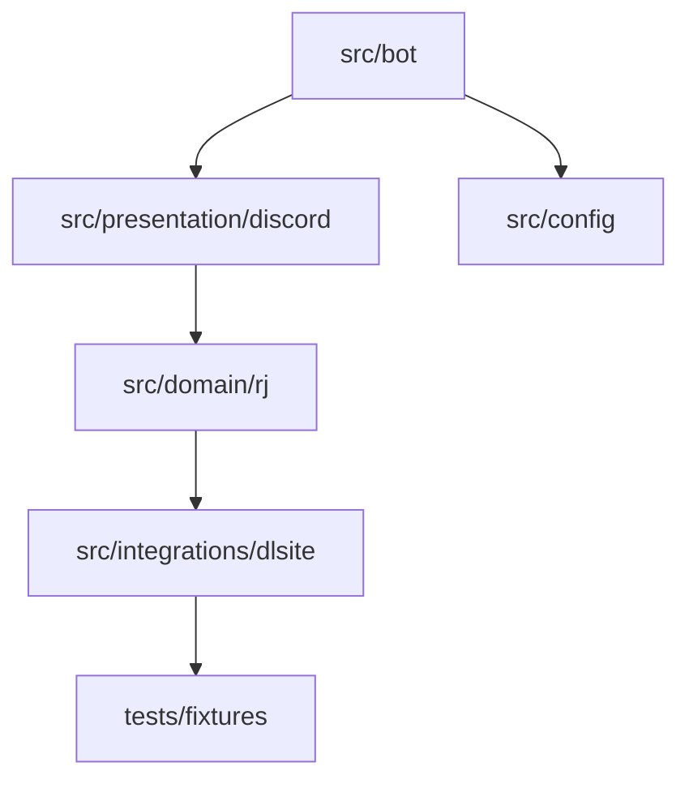

# DLSite RJ Preview Bot Agent Guide

このファイルは、実装時の運用ルールだけをまとめる。詳細要件と設計は `docs/` を参照すること。

## Operating Baseline

- 全体運用の正本は `~/.codex/AGENTS.md` とし、このリポジトリのルールはそれと矛盾しない範囲で補足する
- プロジェクト固有スキルは `.codex/skills/<skill>/SKILL.md` を参照する
- ローカル配置が必要なスキルは `.codex/skills/<skill>/` へ最小限だけ配置する
- 初回ローカル配置対象は `brainstorming`, `writing-plans`, `executing-plans`, `systematic-debugging`, `requesting-code-review`, `empirical-prompt-tuning`

## Recommended Skills

- `.codex/skills/brainstorming/SKILL.md`
- `.codex/skills/writing-plans/SKILL.md`
- `.codex/skills/executing-plans/SKILL.md`
- `.codex/skills/systematic-debugging/SKILL.md`
- `.codex/skills/requesting-code-review/SKILL.md`
- `.codex/skills/empirical-prompt-tuning/SKILL.md`

## Command Policy

- `package.json` は最小 scripts のみ維持する
- 補助コマンドは `justfile` に寄せる
- 品質ゲートは `Biome + lefthook + Vitest` を前提にする

## Quality Policy

- formatter と linter は `Biome`
- test runner は `Vitest`
- pre-commit は `lefthook`
- `tsc --noEmit` を型検査の基準にする

## NG Patterns

- Discord handler に取得、解析、整形、返信を全部詰め込む
- HTML を広範囲に正規表現だけで解析する
- `process.env` を各所で直接読む
- NSFW 判定なしで常に詳細表示する
- pre-commit を通らない差分を前提に進める

## Structure

## Implementation Notes

- Discord ハンドラは薄く保つ
- parser と formatter を分離する
- `.env` の検証は `zod` で起動時にまとめて行う
- 詳細要件、NSFW 制御、キャッシュ仕様は `docs/requirements.md` と `docs/implementation-plan.md` を参照する

## Completion Flow

1. `.codex/skills/requesting-code-review/SKILL.md` を使って main マージ前レビューを行う
2. `.codex/skills/empirical-prompt-tuning/SKILL.md` を使って今回触れた `.codex/skills/<skill>/SKILL.md` を必要に応じて最適化する
3. `/clear` でコンテキストをリセットする
