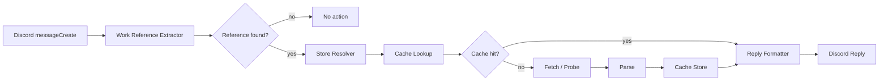

# DLSite/FANZA Preview Bot Architecture

## 1. Architecture Summary

この Bot は Discord の `messageCreate` イベントを入口に、作品参照抽出、store 解決、fetch / probe、HTML 解析、キャッシュ、Discord 返信整形を順に流すパイプライン構成を取る。責務分離を優先し、Discord ハンドラは薄く保つ。

## 2. High-Level Flow



## 3. Component Responsibilities

### `src/bot`

- Bun エントリポイント
- Discord Client 初期化
- shutdown 処理

### `src/presentation/discord`

- `messageCreate` ハンドラ
- Discord Embed 生成
- NSFW 判定
- `generic` / `fanza_url_required` の失敗応答組み立て

### `src/domain/rj`

- 作品参照抽出
- DLSite / DMM family の参照正規化
- fetcher / parser の store 解決
- 共通ドメイン型の定義
- キャッシュインターフェース

### `src/integrations/dlsite`

- DLSite URL 生成
- HTTP 取得
- `cheerio` による HTML 解析
- DLSite 固有の DOM 依存処理

### `src/integrations/dmm`

- DMM family URL 解決と bare probe
- 年齢確認を含む HTTP 取得
- `cheerio` による HTML 解析
- FANZA同人 / DMM TV / FANZA PCゲーム / FANZA BOOKS の DOM 依存処理

### `src/config`

- `.env` 読み込み
- `zod` による設定検証
- 実行時設定の公開

### `tests/fixtures`

- DLSite / DMM family の HTML fixture
- parser テスト用の壊れた DOM fixture

## 4. Project Structure

```text
src/
  bot/
  config/
  domain/
    rj/
  integrations/
    dlsite/
    dmm/
  presentation/
    discord/
tests/
  fixtures/
docs/
```

## 5. Core Interfaces

```ts
type WorkReference = {
  store: "dlsite" | "fanza_doujin" | "dmm_tv_av" | "fanza_pcgame" | "fanza_books";
  id: string;
  kind: "code" | "url";
  sourceUrl?: string;
  matchedText: string;
};

type FetchedWorkPage = {
  store: WorkReference["store"];
  html: string;
  fetchedUrl: string;
  resolvedUrl: string;
  pageKind: "work" | "age_check" | "not_found" | "unknown";
  status: number;
};

type WorkPreview = {
  store: WorkReference["store"];
  id: string;
  title: string;
  url: string;
  makerName: string | null;
  ageCategory: string | null;
  isAdult: boolean;
  price: string | null;
  salePrice: string | null;
  releaseDate: string | null;
  rating: string | null;
  thumbnailUrl: string | null;
  tags: string[];
  parseCoverage: "full" | "partial";
  serviceName: string | null;
};

declare function extractWorkReferences(message: string): WorkReference[];
declare function fetchWorkPage(reference: WorkReference): Promise<FetchedWorkPage>;
declare function parseWork(page: FetchedWorkPage, reference: WorkReference): WorkPreview;
declare function buildPreviewMessage(
  work: WorkPreview,
  channelIsNsfw: boolean,
): DiscordReplyPayload;
```

## 6. Resolution Strategy

- `extractWorkReferences` は URL、DLSite bare ID、DMM family bare ID、`av:` / `game:` / `book:` プレフィックスを同一列で抽出する。
- `resolve-work.ts` は `store` に応じて DLSite fetcher / parser と DMM fetcher / parser を切り替える。
- DMM family の URL 入力は canonical 化に必要な query を保持したまま取得する。
- FANZA同人 bare ID は probe 成功時のみ canonical URL に昇格し、失敗時は `fanza_url_required` を返す。

## 7. NSFW Policy

- DLSite と DMM family の双方で `isAdult` を判定対象にする。
- 非 NSFW チャンネルでは成人向け詳細を抑制する。
- 特に DMM family は `parseCoverage` が `partial` でも `full` でも、非 NSFW では最小表示へ倒す。
- 詳細の公開判断に迷う場合は抑制側を優先する。

## 8. Dependency Decisions

- `discord.js`: Discord イベント処理と Embed 生成
- `cheerio`: サーバーサイド HTML 解析
- `zod`: `.env` の厳格検証
- `vitest`: unit test
- `biome`: format / lint
- `lefthook`: pre-commit hook

追加ライブラリは最小限に留め、HTTP 取得は Bun 標準 `fetch` を基本とする。

## 9. Configuration Strategy

- 設定の正本は `.env`
- 起動時に `zod` で全項目を検証し、不正値なら fail fast で起動を止める
- `process.env` の直接参照は `src/config` に閉じ込める

## 10. Error Handling Policy

- fetch 層は HTTP エラーや age-check 失敗をアプリ固有例外へ変換する。
- parser 層は必須 DOM 欠落時に解析例外を返す。
- resolution 層は FANZA同人 bare 未解決時に `WorkPreviewResolutionError("fanza_url_required")` を返す。
- presentation 層は例外詳細を隠し、短い失敗応答へ変換する。
- ログは取得失敗、解析失敗、返信失敗を区別して残す。

## 11. Runtime And Operations

- `package.json` scripts は最小限に留める。
- 補助操作は `justfile` に寄せる。
- 常駐運用は `pm2` を正式採用とする。

## 12. Design Constraints

- Discord ハンドラに取得、解析、整形、例外分岐を詰め込まない。
- HTML 全体を正規表現だけで解析しない。
- NSFW 判定なしで常に詳細を返さない。
- 短命メモリキャッシュのため、プロセス再起動でキャッシュ消失する前提を受け入れる。

## 13. Agent Operations

- エージェント運用の基準は `~/.codex/AGENTS.md` を正本とする。
- プロジェクト固有で参照するスキルは `.codex/skills/<skill>/SKILL.md` に配置する。
- 初回配置は必要最小限とし、不足分だけ `~/.claude/skills/<skill>/` からコピーして補う。
