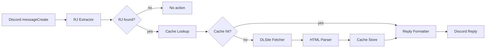

# DLSite RJ Preview Bot Architecture

## 1. Architecture Summary

この Bot は Discord の `messageCreate` イベントを入口に、RJ 抽出、DLSite 取得、HTML 解析、Discord 返信整形を順に流す単純なパイプライン構成とする。責務分離を優先し、Discord ハンドラは薄く保つ。

## 2. High-Level Flow



## 3. Component Responsibilities

### `src/bot`

- Bun エントリポイント
- Discord Client 初期化
- shutdown 処理

### `src/presentation/discord`

- `messageCreate` ハンドラ
- Discord Embed 生成
- NSFW 判定
- 失敗時の簡潔返信組み立て

### `src/domain/rj`

- RJ コード抽出
- コード正規化
- 作品ドメイン型の定義
- キャッシュインターフェース

### `src/integrations/dlsite`

- URL 生成
- HTTP 取得
- `cheerio` による HTML 解析
- DLSite 固有の DOM 依存処理

### `src/config`

- `.env` 読み込み
- `zod` による設定検証
- 実行時設定の公開

### `tests/fixtures`

- DLSite 作品 HTML fixture
- parser テスト用の壊れた DOM fixture

## 4. Proposed Project Structure

```text
src/
  bot/
  config/
  domain/
    rj/
  integrations/
    dlsite/
  presentation/
    discord/
tests/
  fixtures/
docs/
```

## 5. Core Interfaces

```ts
type DLSiteWork = {
  id: string;
  title: string;
  url: string;
  makerName: string | null;
  price: string | null;
  salePrice: string | null;
  ageCategory: string | null;
  releaseDate: string | null;
  rating: string | null;
  thumbnailUrl: string | null;
  tags: string[];
  isAdult: boolean;
  author?: string | null;
  scenario?: string | null;
  illustration?: string | null;
  voiceActors?: string[];
  fileFormat?: string | null;
  fileSize?: string | null;
};

declare function extractRjCodes(message: string): string[];
declare function fetchWorkPage(rjCode: string): Promise<string>;
declare function parseWork(html: string, rjCode: string): DLSiteWork;
declare function buildPreviewMessage(
  work: DLSiteWork,
  channelIsNsfw: boolean,
): DiscordReplyPayload;
```

## 6. Dependency Decisions

- `discord.js`: Discord イベント処理と Embed 生成
- `cheerio`: サーバーサイド HTML 解析
- `zod`: `.env` の厳格検証
- `vitest`: unit test
- `biome`: format / lint
- `lefthook`: pre-commit hook

追加ライブラリは初版では最小限に留め、HTTP 取得は Bun 標準 `fetch` を基本とする。

## 7. Configuration Strategy

- 設定の正本は `.env`
- 起動時に `zod` で全項目を検証し、不正値なら fail fast で起動を止める
- `process.env` の直接参照は `src/config` に閉じ込める

推奨例:

```ts
import { z } from "zod";

const envSchema = z.object({
  DISCORD_BOT_TOKEN: z.string().min(1),
  DISCORD_CLIENT_ID: z.string().min(1).optional(),
  CACHE_TTL_MS: z.coerce.number().int().positive(),
  DLSITE_USER_AGENT: z.string().min(1),
  NSFW_STRICT_MODE: z.enum(["true", "false"]).transform((v) => v === "true"),
});

export const env = envSchema.parse(process.env);
```

## 8. Runtime And Operations

### 正式採用

- `pm2`
  - 再起動制御
  - ログ確認
  - 自宅 macOS での常駐運用に向く

### 比較のみ

- `LaunchAgent`
  - OS ネイティブだが、アプリ固有の運用知識がやや増える
- `Docker Compose`
  - 再現性は高いが v1 の個人運用には過剰

## 9. Error Handling Policy

- fetch 層は HTTP エラーをアプリ固有例外へ変換する
- parser 層は必須 DOM 欠落時に解析例外を返す
- presentation 層は例外詳細を隠し、短い失敗応答へ変換する
- ログは取得失敗、解析失敗、Discord 返信失敗を区別して残す

## 10. Package / Command Policy

- `package.json` scripts は最小限に留める
  - 例: `dev`, `build`, `typecheck`, `test`, `lint`, `format`
- 補助操作は `justfile` に寄せる
  - `just check`
  - `just dev`
  - `just pm2-start`

この方針により、npm scripts の肥大化を防ぎつつ、日常運用コマンドを整理する。

## 11. Agent Operations

- エージェント運用の基準は `~/.codex/AGENTS.md` を正本とする
- プロジェクト固有で参照するスキルは `.codex/skills/<skill>/SKILL.md` に配置する
- 初回配置は必要最小限とし、不足分だけ `~/.claude/skills/<skill>/` からコピーして補う

## 12. Design Constraints

- Discord ハンドラに取得・解析・整形・エラーハンドリングを詰め込まない
- HTML 全体を正規表現だけで解析しない
- NSFW 判定なしで常に詳細を返さない
- 短命メモリキャッシュのため、プロセス再起動でキャッシュ消失する前提を受け入れる
