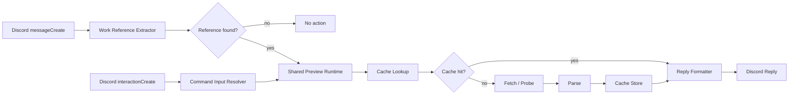

# DLSite/FANZA Preview Bot Architecture

## 1. Architecture Summary

この Bot は Discord の `messageCreate` と `interactionCreate` を入口に、`WorkReference` 解決、fetch / probe、HTML 解析、キャッシュ、Discord 返信整形を共有するパイプライン構成を取る。責務分離を優先し、Discord ハンドラは薄く保つ。

## 2. High-Level Flow



## 3. Component Responsibilities

### `src/bot`

- Bun エントリポイント
- Discord Client 初期化
- shutdown 処理

### `src/presentation/discord`

- `messageCreate` ハンドラ
- `interactionCreate` ハンドラ
- Slash Command 定義と help 応答
- command 登録同期
- Discord Embed 生成
- NSFW 判定
- `generic` / `fanza_url_required` の失敗応答組み立て
- `/search` セッション管理・ページングボタン（`search-runtime.ts`）
- `/random` の複数件（最大5件）並列抽選・セッション管理・ページングボタン・Discord Components V2メッセージ組み立てとプレビューパイプラインへの橋渡し（`random-runtime.ts`, `build-random-message.ts`）
- `/random` 用circlePool/genrePoolのプロセス単位シングルトン共有（`shared-random-pools.ts`）

### `src/domain/rj`

- 作品参照抽出
- DLSite / DMM family の参照正規化
- fetcher / parser の store 解決
- 共通ドメイン型の定義
- キャッシュインターフェース

### `src/domain/search`

- `/search` のクエリ型（`SearchQuery`）とstore別フェッチャーディスパッチ（`resolveSearchFetcher`、実装済みtarget一覧`IMPLEMENTED_SEARCH_TARGETS`）
- circle（サークル名）2段階解決ロジック
- 検索セッションのTTLキャッシュ

### `src/domain/random`

- `/random` のランダム抽選アルゴリズム（`pick-random-work.ts`: 1ページ目取得→総件数からランダムページ算出→そのページ内で乱選）
- ジャンルマスターリストのTTLキャッシュ（`genre-pool.ts`）
- 実行結果から収集するサークル/ブランドのインメモリプール（`circle-pool.ts`）
- 複数件結果のページングセッション用TTLキャッシュ（`random-session-cache.ts`。`domain/search/session-cache.ts`と同型、`RandomSession`/`RandomResolvedWork`型を定義）

### `src/integrations/dlsite`

- DLSite URL 生成
- HTTP 取得
- `cheerio` による HTML 解析
- DLSite 固有の DOM 依存処理
- 検索AJAXエンドポイント・サークル一覧・ジャンルマスターリストの取得/解析

### `src/integrations/dmm`

- DMM family URL 解決と bare probe
- 年齢確認を含む HTTP 取得
- `cheerio` による HTML 解析
- FANZA同人 / DMM TV / FANZA PCゲーム / FANZA BOOKS の DOM 依存処理
- FANZA同人の検索URL・ブランド一覧・ジャンル/タグマスターリストの取得/解析

### `src/config`

- `.env` 読み込み
- `zod` による設定検証
- 実行時設定の公開

### `tests/fixtures`

- DLSite / DMM family の HTML fixture
- parser テスト用の壊れた DOM fixture

## 4. Project Structure

```text
src/
  bot/
  config/
  domain/
    rj/
    search/
    random/
  integrations/
    dlsite/
    dmm/
  presentation/
    discord/
tests/
  fixtures/
docs/
```

## 5. Core Interfaces

```ts
type WorkReference = {
  store: "dlsite" | "fanza_doujin" | "dmm_tv_av" | "fanza_pcgame" | "fanza_books";
  id: string;
  kind: "code" | "url";
  sourceUrl?: string;
  matchedText: string;
};

type FetchedWorkPage = {
  store: WorkReference["store"];
  html: string;
  fetchedUrl: string;
  resolvedUrl: string;
  pageKind: "work" | "age_check" | "not_found" | "unknown";
  status: number;
};

type WorkPreview = {
  store: WorkReference["store"];
  id: string;
  title: string;
  url: string;
  makerName: string | null;
  ageCategory: string | null;
  isAdult: boolean;
  price: string | null;
  salePrice: string | null;
  releaseDate: string | null;
  rating: string | null;
  thumbnailUrl: string | null;
  tags: string[];
  parseCoverage: "full" | "partial";
  serviceName: string | null;
};

declare function extractWorkReferences(message: string): WorkReference[];
declare function fetchWorkPage(reference: WorkReference): Promise<FetchedWorkPage>;
declare function parseWork(page: FetchedWorkPage, reference: WorkReference): WorkPreview;
declare function resolvePreviewReference(input: {
  commandName: "dlsite" | "fanza";
  subcommand: string;
  input: string;
}): { reference: WorkReference } | { usage: string };
declare function buildPreviewMessage(
  work: WorkPreview,
  channelIsNsfw: boolean,
): DiscordReplyPayload;
```

## 6. Resolution Strategy

- `extractWorkReferences` は URL、DLSite bare ID、DMM family bare ID、`av:` / `game:` / `book:` プレフィックスを同一列で抽出する。
- Slash Command 側は `resolvePreviewReference` でサブコマンドに対応する `WorkReference` を明示生成する。
- `resolve-work.ts` は `store` に応じて DLSite fetcher / parser と DMM fetcher / parser を切り替える。
- DMM family の URL 入力は canonical 化に必要な query を保持したまま取得する。
- FANZA同人 bare ID は probe 成功時のみ canonical URL に昇格し、失敗時は `fanza_url_required` を返す。

## 6.1 Command Registration Strategy

- 起動時に application command を同期する。
- `DISCORD_GUILD_ID` がある場合は guild commands を優先登録する。
- `DISCORD_GUILD_ID` がない場合は global commands を登録する。
- command 定義は `discord.js` 標準の builder で 1 箇所に集約する。

## 6.2 Random Discovery Strategy

`/random` は「有効な作品IDの候補プールをどう集めるか」という問題を、ID乱数生成ではなく `/search` の検索結果一覧を母集団として使うことで解決する。

- **ブラウズ**: DLsite/FANZA同人の検索URLビルダーはkeyword省略時に全件ブラウズURL（keywordセグメント自体を省略）を組み立てられる。1ページ目の総件数からランダムなページ番号を算出し、そのページ内で1件選ぶ（`pick-random-work.ts`）。
- **ジャンルfacet**: DLsite（`/{surface}/genre/list`）・FANZA同人（`/dc/doujin/-/genre/`）が公開するジャンル/タグ一覧ページを取得し、`genre-pool.ts`が24時間TTLでキャッシュする。取得失敗時は空リストにフォールバックし、ジャンルfacetは自動的に候補から除外される。
- **サークルfacet**: 専用の一覧ページが存在しないため、`/random`・`/search`・`/dlsite`・`/fanza`の実行結果から実在確認済みのサークル/ブランド（makerId + makerName）を`circle-pool.ts`が収集する。プールに入る値は必ず過去に実在が確認できた値のため、無効な値を抽選するリスクが構造的に発生しない。
- store・keywordを明示指定した場合は、facetによる上書きをせずそのまま検索する（`/search`と同じ予測可能な挙動）。
- 抽選結果は`SearchResultItem`が既に保持する実URLを使って`WorkReference(kind:"url")`を組み立て、既存のプレビューパイプライン（`fetchWorkPage` / `parseWork`）へそのまま渡す。

### 6.2.1 Batch Resolution（複数件並列抽選）

- `random-runtime.ts`の`resolveBatch`が、`RANDOM_BATCH_TARGET_COUNT`（5）件を並列ワーカープールで抽選する。各workerは独立して`attemptOnce`（候補クエリ組み立て→抽選→作品詳細取得の1回分）を繰り返し、目標件数に達するか合計試行回数の上限（5件×3回=15回）に達するまでループする。
- 個別の枠が失敗した場合、そのworkerは自動的に新しい候補で再試行する（＝部分失敗の埋め合わせ。全体を失敗にしない）。
- `reserved`カウンタをawaitを挟まず同期的にインクリメント/デクリメントすることで、複数workerが同時に目標件数を超えて予約してしまう競合状態を防いでいる。
- 上限に達しても目標件数に届かない場合は、その時点で集まった件数（0件のこともある）をそのまま返す。0件の場合のみ「該当なし」または「汎用エラー」メッセージを返す。

### 6.2.2 Result Session and Components V2 UI

- 抽選結果（`RandomResolvedWork[]`、最大5件）は`random-session-cache.ts`（`domain/search/session-cache.ts`と同型のTTLキャッシュ）に`RandomSession{token, results, currentIndex, channelId, messageId}`として保存する。
- 表示は`build-random-message.ts`がDiscord Components V2（`MessageFlags.IsComponentsV2`）で組み立てる。`ContainerBuilder`1個に「まとめブロック（全件、サムネイルなし、商品名へのMarkdownハイパーリンク＋サークル・価格・発売日・評価・声優/著者）」→区切り→「詳細ブロック（`currentIndex`が指す1件のみ、サムネイルがあれば`SectionBuilder`+`ThumbnailBuilder`、無ければ`TextDisplayBuilder`のみへフォールバック）」→ページングボタン（`ActionRowBuilder`）を積む。
- `IsComponentsV2`フラグは一度付与すると解除できないため、通常表示・ページング更新・アイドルタイムアウトによるdisabled化のいずれでも必ず付与する。
- Prev/Nextボタン（`random:{token}:prev|next`）は`currentIndex`の入れ替えのみで完結し、5件は事前に全件解決済みのため上流への再フェッチは発生しない（`/search`の「次へ」と異なり`deferUpdate`も不要）。
- NSFW抑制は`build-preview-message.ts`の`shouldSuppress`を共有し、まとめブロック・詳細ブロックの両方で作品単位に適用する（非NSFWチャンネルの成人向け作品はタイトル・URLのみに抑制）。
- アイドルタイムアウトは`/search`と同じ`Map<token, Timer>`パターンで実装し、失効時は`buildDisabledRandomMessage`で両ボタンを無効化する。

## 7. NSFW Policy

- DLSite と DMM family の双方で `isAdult` を判定対象にする。
- 非 NSFW チャンネルでは成人向け詳細を抑制する。
- 特に DMM family は `parseCoverage` が `partial` でも `full` でも、非 NSFW では最小表示へ倒す。
- 詳細の公開判断に迷う場合は抑制側を優先する。

## 8. Dependency Decisions

- `discord.js`: Discord イベント処理と Embed 生成
- `cheerio`: サーバーサイド HTML 解析
- `zod`: `.env` の厳格検証
- `vitest`: unit test
- `biome`: format / lint
- `lefthook`: pre-commit hook

追加ライブラリは最小限に留め、HTTP 取得は Bun 標準 `fetch` を基本とする。

## 9. Configuration Strategy

- 設定の正本は `.env`
- 起動時に `zod` で全項目を検証し、不正値なら fail fast で起動を止める
- `process.env` の直接参照は `src/config` に閉じ込める

## 10. Error Handling Policy

- fetch 層は HTTP エラーや age-check 失敗をアプリ固有例外へ変換する。
- parser 層は必須 DOM 欠落時に解析例外を返す。
- resolution 層は FANZA同人 bare 未解決時に `WorkPreviewResolutionError("fanza_url_required")` を返す。
- presentation 層は例外詳細を隠し、短い失敗応答へ変換する。
- ログは取得失敗、解析失敗、返信失敗を区別して残す。

## 11. Runtime And Operations

- `package.json` scripts は最小限に留める。
- 補助操作は `justfile` に寄せる。
- 常駐運用は `pm2` を正式採用とする。

## 12. Design Constraints

- Discord ハンドラに取得、解析、整形、例外分岐を詰め込まない。
- HTML 全体を正規表現だけで解析しない。
- NSFW 判定なしで常に詳細を返さない。
- 短命メモリキャッシュのため、プロセス再起動でキャッシュ消失する前提を受け入れる。
- `/random`のサークルプールもインメモリのため、プロセス再起動直後はブラウズ抽選のみに戻る（使うほど条件付きランダムの幅が広がる設計として受け入れる）。
- `/random`のジャンルfacetはDLsite同人・FANZA同人のみ対応（他storeは一覧ページ有無を要確認）。声優・価格帯はランダム抽選対象に含めない。
- `/random`の複数件抽選は近似的な一様分布であり厳密な全件一様ランダムではない（`pick-random-work.ts`と同じ制約）。5件に満たない部分成功でもエラーにせず表示し、件数不足を明示するUIは持たない。
- `/random`のComponents V2表示は`/random`にのみ適用し、`/search` / `/dlsite` / `/fanza`は既存のEmbedベースのまま変更しない（`IsComponentsV2`はメッセージ単位のフラグで一度付与すると解除できないため）。

## 13. Agent Operations

- エージェント運用の基準は `~/.codex/AGENTS.md` を正本とする。
- プロジェクト固有で参照するスキルは `.codex/skills/<skill>/SKILL.md` に配置する。
- 初回配置は必要最小限とし、不足分だけ `~/.claude/skills/<skill>/` からコピーして補う。
